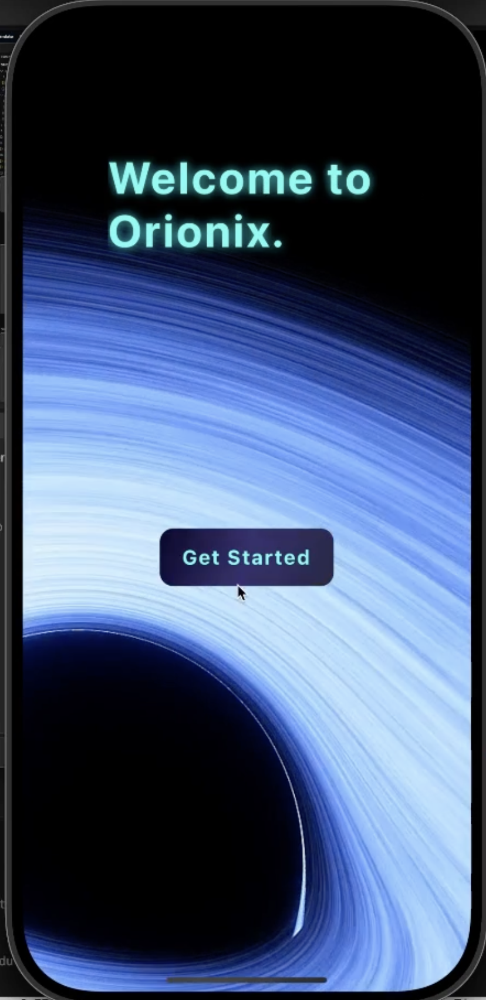
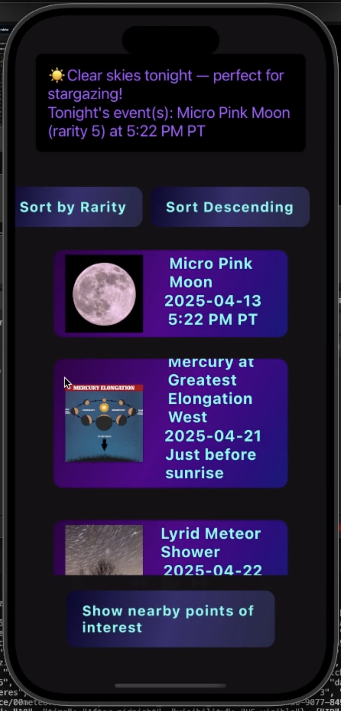
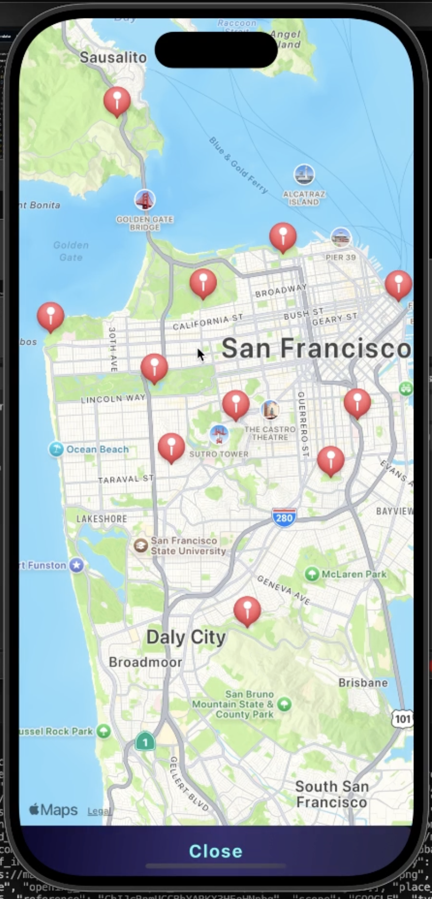

# Orionix (backend)
---
This is the backend portion for **Orionix**, a mobile app that lets users find stargazing events and give them realistic guidance regarding whether or not they can experience the event.

Orionix was ***developed in 24 hours*** for [FullyHacks 2025](https://fullyhacks.acmcsuf.com/) Hackathon by myself and [Vladyslav Korenevskyi](https://github.com/tmbkoren).

---

## The Menus

  

---
## Getting Started

In order to run Orionix on your laptop, follow *these* steps:

- Create a virtual environment using `python3 -m venv venv`
- Activate it with `source venv/bin/activate`
- Install dependencies with `pip install -r requirements.txt`
- Run with `uvicorn app.routes:app --reload`
  
---
## Resources Used

* [OpenWeather](https://openweathermap.org/api) - API used to gather weather data
* [Google (speficially Places)](https://developers.google.com/maps/documentation/places/web-service/overview) - API used to integrate the map
* [React Native](https://reactnative.dev/) - Frontend, built with React
* [FastAPI](https://fastapi.tiangolo.com/) - For the backend API we created

# How it works:

Diagram here
