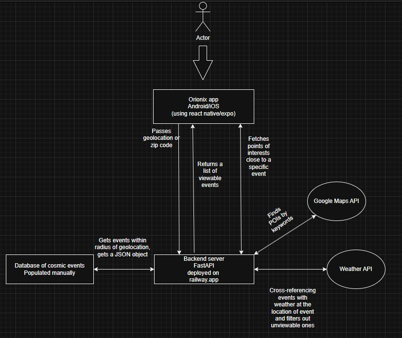

# Orionix (backend)
---
This is the backend portion for **Orionix**, a mobile app that lets users find stargazing events and give them realistic guidance regarding whether or not they can experience the event.

Orionix was ***developed in 24 hours*** for [FullyHacks 2025](https://fullyhacks.acmcsuf.com/) Hackathon by myself and [Vladyslav Korenevskyi](https://github.com/tmbkoren).

**[View the Frontend Repository](https://github.com/tmbkoren/Orionix_front)**

---

# App Preview

<p align="center">
  
  <br>
  <em>The Main Menu prompts users for their location to find nearby events (background is animated).</em>
</p>
<p align="center">
  
  <br>
  <em>The Events screen shows upcoming celestial events, sorted by rarity and viewing conditions.</em>
</p>
<p align="center">
  
  <br>
  <em>The Map screen displays nearby locations with low light pollution, perfect for stargazing.</em>
</p>

---

# Key Features

#### 📍 Dynamic Location Input
* Automatically detects user location via a native pop-up for immediate results.
* Provides a manual zip code entry as a fallback for privacy or if permissions are denied.

#### ✨ Smart Event Feed
* **Weather Integration:** Uses the OpenWeather API to provide a "go" or "no-go" sentiment for viewing conditions.
* **Rarity System:** A custom algorithm ranks celestial events by rarity to highlight unique opportunities.
* **Custom Sorting:** Users can sort events to easily find what they're looking for.

#### 🗺️ Optimal Location Finder
* **Intelligent Search:** Leverages the Google Places API to find nearby locations with low light pollution, such as parks, trails, and hills.
* **Interactive Map:** Displays recommended spots on a map centered on the user's location.
* **Instant Directions:** Users can tap any location to get its name and look for directions.

---

# How it works:



---

# Tech Stack

* **Hosting:** [Railway](https://railway.com/) - Cloud application hosting.
* **Backend:** [FastAPI](https://fastapi.tiangolo.com/) - A modern, high-performance Python web framework.
* **Frontend:** [React Native](https://reactnative.dev/) - Cross-platform mobile app development.
* **APIs:**
    * [OpenWeather API](https://openweathermap.org/api) - Used to gather weather data for viewing conditions.
    * [Google Places API](https://developers.google.com/maps/documentation/places/web-service/overview) - Used to find optimal stargazing locations.

---

# Getting Started

Follow these instructions to get the backend running on your local machine.

### Prerequisites

- Python
- An API key from [OpenWeather](https://openweathermap.org/api)
- A [Google Places API](https://developers.google.com/maps/documentation/places/web-service/overview) key

### Installation

1.  **Clone the repository:**
    ```sh
    git clone https://github.com/Batu-end/Orionix-backend.git
    cd Orionix_backend
    ```

2.  **Create and activate a virtual environment:**
    ```sh
    python3 -m venv venv
    source venv/bin/activate
    ```

3.  **Install the dependencies:**
    ```sh
    pip install -r requirements.txt
    ```

4.  **Set up your environment variables:**
    Create a file named `.env` in the root directory and add your API keys. Use the `.env.example` file as a template:
    ```
    # .env file
    OPENWEATHER_API_KEY="your_openweather_api_key"
    GOOGLE_PLACES_API_KEY="your_google_places_api_key"
    ```

5.  **Run the application:**
    ```sh
    uvicorn app.routes:app --reload
    ```
    The server will be running at `http://127.0.0.1:8000`.
    
